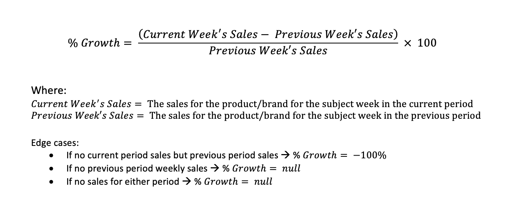

# Retail Spotlight Backend Challenge

## Introduction
The aim of this take-home technical challenge is to allow us to not only assess your technical abilities, but more importantly, to understand your approach at tackling these kinds of problems. The exercise has been designed to be comparable to the work you may be doing in our business, tackling some of the common problems we see in our solutions.

As this is a take-home challenge, there isn't a time limit, however it shouldn't take you more than 3-4 hours. Once submitted, we will review your solution and schedule a follow up call to discuss it with you. **Note: If you reach the time limit, please do not feel you must continue. Submit what you have, even if not fully complete, and we will still discuss your solution with you.**

We're expecting you to create a Python solution built as is if it would be production code, meaning it should be structured and commented appropriately. We are expecting at least some unit test coverage, so we can see how you approach testing, as well as the problem itself.

## Brief
One way our Pinpoint platform provides value for our clients is by allowing users to generate on-demand reports which display the sales performance of certain products/brands/distributors etc. over time.

To do this, we extract transaction information from our database and perform calculations to convert the raw data into meaningful measures. These meaningful measures are then exported into a format compatible with our React front-end, which renders the information for our users in a dashboard. 

Your task is to create a simple sales performance report processor that:

1. Ingests sample data from the provided data files
1. Calculates the weekly sales value growth and sale units growth for each product & brand for each week
1. Output the results for the products & brands into a json file that could be used by a frontend to display the results


## Tasks

### Task 1 - Ingest Sample Data 

The `data/` directory holds two sample data files:

- `sales_product.csv` - Stores the total weekly sales of each product for the current & previous period
- `sales_brand.csv` - Stores the total weekly sales of each brand for the current & previous period

The column definitions for the files can be seen in [Appendix A](#a---sample-data-column-definitions)

You should ingest these files into a suitable data structure inside your program, ensuring the correct types for each column.


### Task 2 - Perform Calculations
This report will calculate the percentage change in the sales of a product / brand for a given week in the current period, compared with the corresponding week in the previous period. For example, comparing sales from the week 04/07/**2022** (£183.08 for Product A) with the sales from the corresponding previous period week - 04/07/**2021** (£152.66 for Product A).

Using your transformed data, calculate the following for each week and for each product / brand, using the formula & edge cases below:

1. Percentage Gross Sales Growth - The percentage change between the current & previous period week's gross sales
2. Percentage Unit Sales Growth - The percentage change between the current & previous period week's unit sales 


All results should be rounded to 2 decimal places. 

**Hint:** After understanding what is required for the calculations, you may want to convert the structure used to store the ingested data into something that helps to make performing the calculations easier.

Formulas:



### Task 3 - Output Results
The results of the calculations, along with the product / brand's identifiable information and date information, should be outputted into a single json file `results.json` in a new `output/` directory in the following structure:

```js

{
	"PRODUCT": [
		{
			"barcode_no": String,
			"product_name": String,
			"current_week_commencing_date": Date,
			"previous_week_commencing_date": Date,
			"perc_gross_sales_growth": Number,
			"perc_unit_sales_growth": Number
		}
	],
	"BRAND": [
		{
			"brand_id": String,
			"brand_name": String,
			"current_week_commencing_date": Date,
			"previous_week_commencing_date": Date,
			"perc_gross_sales_growth": Number,
			"perc_unit_sales_growth": Number
		}
	]
}
```

The output file should be sorted by the name of the product / brand and the current period week commencing date.


## Getting Started

We have provided a skeleton repository which mimics how we setup our repos internally:

- `data/` contains the sample data for the exercise
- `src/` **is where you should write your python code**
- `tests/` contains a skeleton test file, **you should write your unit tests here**
- `requirements.txt` holds pip package requirements to be installed into the virtualenv
- `Makefile` provides useful targets to create a virtualenv & test your code.


When assessing your solution use of unit testing, we will run the following:
- `make init` to create a new virtualenv
- `make requirements` to install any requirements you use
- `make test` to run the unit tests


### Q: Can I use a different testing library?
We have the repository pre-configured to use `pytest` and `coverage` as these are the libraries we use. However, if you'd rather use a testing library you are more comfortable with, you may do so. 

We ask that you email us to let us know, and provide some alternate commands for running your tests.

## Questions & Assumptions
We expect you may have questions or make assumptions about the exercise. If this is the case, either email us with your questions, or note down your assumptions and include them in a text file in the final solution's repository.

## Submitting your Solution
To submit your solution, please upload your solution to a personal github/bitbucket account, make public and email us the link.


## Appendix

### A - Sample Data Column Definitions

| Column Name          | Type    | Description                                                               |
|:---------------------|:--------|:--------------------------------------------------------------------------|
| period_id            | Integer | The unique identifier for the period                                      |
| period_name          | String  | The label for the period ('current' / 'previous')                         |
| week_commencing_date | Date    | The date the record week commenced on                                     |
| barcode_no           | String  | The unique identifier for a product                                       |
| product_name         | String  | The name / description of the product                                     |
| brand_id             | Integer | The unique identifier for the brand                                       |
| brand_name           | String  | The name / description of the brand                                       |
| gross_sales          | Float   | The total gross sales value for that product / brand in the week (pounds) |
| units_sold           | Integer | The total number of units of the product / brand sold in the given week   |

